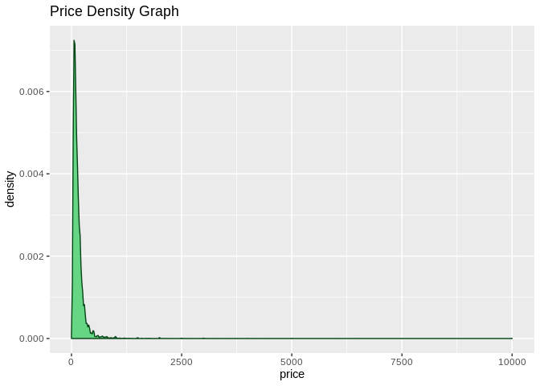
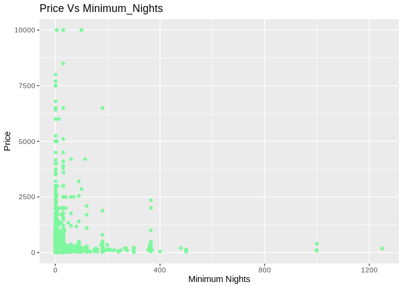
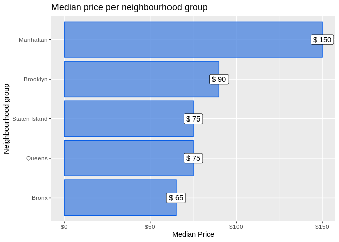
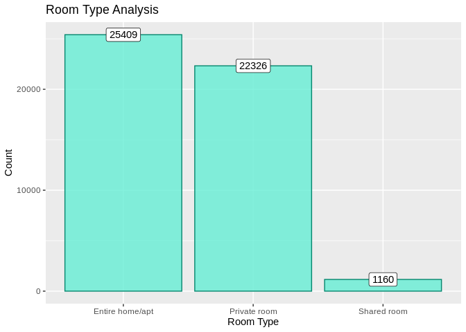
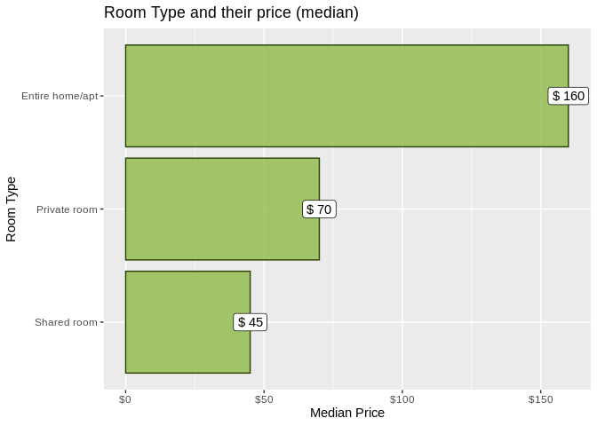
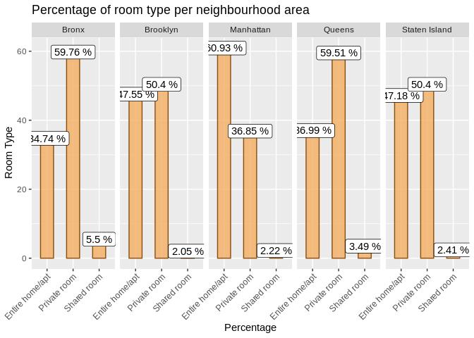

Airbnb NYC open data
================

# **Overview**

Since 2008, guests and hosts have used Airbnb to expand on traveling
possibilities and present more unique, personalized way of experiencing
the world.This dataset describes the listing activity and metrics in
NYC, NY for 2019.

``` r
# installing packages

# loading libraries
library(ggplot2)
library(e1071)
library(scales)
library(dplyr)
```

    ## 
    ## Attaching package: 'dplyr'

    ## The following objects are masked from 'package:stats':
    ## 
    ##     filter, lag

    ## The following objects are masked from 'package:base':
    ## 
    ##     intersect, setdiff, setequal, union

``` r
library(tidyr)
library(RColorBrewer)
```

***Importing Datasets***

``` r
our.data = read.csv("input/AB_NYC_2019.csv", stringsAsFactors = F)
```

***Data Preprocessing***

``` r
dim(our.data)
```

    ## [1] 48895    16

``` r
str(our.data)
```

    ## 'data.frame':    48895 obs. of  16 variables:
    ##  $ id                            : int  2539 2595 3647 3831 5022 5099 5121 5178 5203 5238 ...
    ##  $ name                          : chr  "Clean & quiet apt home by the park" "Skylit Midtown Castle" "THE VILLAGE OF HARLEM....NEW YORK !" "Cozy Entire Floor of Brownstone" ...
    ##  $ host_id                       : int  2787 2845 4632 4869 7192 7322 7356 8967 7490 7549 ...
    ##  $ host_name                     : chr  "John" "Jennifer" "Elisabeth" "LisaRoxanne" ...
    ##  $ neighbourhood_group           : chr  "Brooklyn" "Manhattan" "Manhattan" "Brooklyn" ...
    ##  $ neighbourhood                 : chr  "Kensington" "Midtown" "Harlem" "Clinton Hill" ...
    ##  $ latitude                      : num  40.6 40.8 40.8 40.7 40.8 ...
    ##  $ longitude                     : num  -74 -74 -73.9 -74 -73.9 ...
    ##  $ room_type                     : chr  "Private room" "Entire home/apt" "Private room" "Entire home/apt" ...
    ##  $ price                         : int  149 225 150 89 80 200 60 79 79 150 ...
    ##  $ minimum_nights                : int  1 1 3 1 10 3 45 2 2 1 ...
    ##  $ number_of_reviews             : int  9 45 0 270 9 74 49 430 118 160 ...
    ##  $ last_review                   : chr  "2018-10-19" "2019-05-21" "" "2019-07-05" ...
    ##  $ reviews_per_month             : num  0.21 0.38 NA 4.64 0.1 0.59 0.4 3.47 0.99 1.33 ...
    ##  $ calculated_host_listings_count: int  6 2 1 1 1 1 1 1 1 4 ...
    ##  $ availability_365              : int  365 355 365 194 0 129 0 220 0 188 ...

*Missing Values*

``` r
# user defined function to find the columns having missing values
missing_df = get_missing_data_df(our.data) 
missing_df
```

    ##         column_name missing_count missing_percent
    ## 1 reviews_per_month         10052           20.56

*Note*: only ‘reviews\_per\_month’ variable has missing values we’ll
replace all NA’s with
0.

``` r
our.data$reviews_per_month = ifelse(is.na(our.data$reviews_per_month), 0, 
                                    our.data$reviews_per_month)
```

*Note*: Still it might be possible that some variables contains empty
fields, which we’ll handle in our exploratory analysis.

***Exploratory
Analysis***

``` r
# Dropping 'Id' and 'host_name' from our dataset as they are insignificant.
our.data = our.data[, -c(1, 4)]
head(our.data, 4)
```

    ##                                  name host_id neighbourhood_group
    ## 1  Clean & quiet apt home by the park    2787            Brooklyn
    ## 2               Skylit Midtown Castle    2845           Manhattan
    ## 3 THE VILLAGE OF HARLEM....NEW YORK !    4632           Manhattan
    ## 4     Cozy Entire Floor of Brownstone    4869            Brooklyn
    ##   neighbourhood latitude longitude       room_type price minimum_nights
    ## 1    Kensington 40.64749 -73.97237    Private room   149              1
    ## 2       Midtown 40.75362 -73.98377 Entire home/apt   225              1
    ## 3        Harlem 40.80902 -73.94190    Private room   150              3
    ## 4  Clinton Hill 40.68514 -73.95976 Entire home/apt    89              1
    ##   number_of_reviews last_review reviews_per_month
    ## 1                 9  2018-10-19              0.21
    ## 2                45  2019-05-21              0.38
    ## 3                 0                          0.00
    ## 4               270  2019-07-05              4.64
    ##   calculated_host_listings_count availability_365
    ## 1                              6              365
    ## 2                              2              355
    ## 3                              1              365
    ## 4                              1              194

Exploring Columns

  - Price

<!-- end list -->

``` r
# Price - Plot Density Graph

ggplot(data = our.data, mapping = aes(x = price)) +
  geom_density(fill = "#45d16a", col = "#054516", alpha = 0.8) +
  ggtitle("Price Density Graph")
```

<!-- -->

``` r
skewness(our.data$price)
```

    ## [1] 19.11777

*NOTE:* We observe that price is highly right skewed, that means a large
amount of property price is less than $500.

  - Minimum Nights

<!-- end list -->

``` r
length(unique(our.data$minimum_nights))
```

    ## [1] 109

``` r
# Scatter plot between Price and minimum_nights
ggplot(data = our.data, mapping = aes(x = minimum_nights, y = price)) +
  geom_point(col = '#7ef79e') +
  ggtitle("Price Vs Minimum_Nights") +
  ylab("Price") +
  xlab("Minimum Nights")
```

<!-- -->

  - Neighbourhood\_group

<!-- end list -->

``` r
length(unique(our.data$neighbourhood_group))
```

    ## [1] 5

``` r
unique(our.data$neighbourhood_group)
```

    ## [1] "Brooklyn"      "Manhattan"     "Queens"        "Staten Island"
    ## [5] "Bronx"

This variable is seems to be a categorical variable, hence changing this
variable to factors.

``` r
# Neighbourhood_group and price
our.data$neighbourhood_group = as.factor(our.data$neighbourhood_group)
```

Creating a new data frame which contains the price median value for each
neighbourhood group.

``` r
price_per_neighbourhood_group = our.data %>% 
  group_by(neighbourhood_group) %>%
  summarise(median_price = median(price))

price_per_neighbourhood_group
```

    ## # A tibble: 5 x 2
    ##   neighbourhood_group median_price
    ##   <fct>                      <dbl>
    ## 1 Bronx                         65
    ## 2 Brooklyn                      90
    ## 3 Manhattan                    150
    ## 4 Queens                        75
    ## 5 Staten Island                 75

A bar graph for Neighbourhood group based on their property
price.

``` r
ggplot(data = price_per_neighbourhood_group, mapping = aes(x = reorder(neighbourhood_group, median_price), 
                                                           y = median_price)) + 
  geom_bar(stat = 'identity', fill = '#5188e0', col = '#095ee6', alpha = 0.8) +
  coord_flip() +
  ggtitle("Median price per neighbourhood group") +
  xlab("Neighbourhood group") +
  ylab("Median Price") +
  scale_y_continuous(labels = dollar) +
  geom_label(mapping = aes(label = paste('$', median_price)))
```

<!-- -->

*NOTE:* Property price at Manhattan is highest among them and Bronx has
the lowest.

  - Room Type

<!-- end list -->

``` r
unique(our.data$room_type)
```

    ## [1] "Private room"    "Entire home/apt" "Shared room"

This variable is seems to be a categorical variable, hence changing it
to factors.

``` r
our.data$room_type = as.factor(our.data$room_type)
```

Plot a bar graph for room type

``` r
ggplot(data = our.data, mapping = aes(x = room_type)) +
  geom_bar(fill = '#66edd4', col = '#07876f', alpha = 0.8) +
  ggtitle("Room Type Analysis") +
  xlab("Room Type") +
  ylab("Count") +
  geom_label(mapping = aes(label = ..count..), stat = 'count')
```

<!-- -->

*NOTE:* Number of ‘Entire home/apt’ and ‘Private room’ is much larger
than that of shared room in our data set.

Creating a new data frame which contains the price median value for each
room type.

``` r
room_type_price_df = our.data %>%
  group_by(room_type) %>%
  summarise(median_price = median(price))

room_type_price_df
```

    ## # A tibble: 3 x 2
    ##   room_type       median_price
    ##   <fct>                  <dbl>
    ## 1 Entire home/apt          160
    ## 2 Private room              70
    ## 3 Shared room               45

Plot a bar graph for Room type and their Price
(Median)

``` r
ggplot(data = room_type_price_df, mapping = aes(x = reorder(room_type, median_price), y = median_price)) +
  geom_bar(stat = 'identity', fill='#8eba47', col='#2a4006', alpha = 0.8) +
  coord_flip() +
  ggtitle("Room Type and their price (median)") +
  xlab("Room Type") +
  ylab("Median Price") +
  scale_y_continuous(labels = dollar) + 
  geom_label(mapping = aes(label = paste("$", median_price)))
```

<!-- -->

*NOTE:* Price of ‘Entire home/apt’ is higher than that of ‘Private Room’
or ‘Shared room’.

Creating a dataframe that contains the percentage of room\_type present
in particular neighbourhood\_group.

``` r
neigh_room.df = our.data %>%
  group_by(neighbourhood_group, room_type) %>%
  summarise(count_room = n())

neigh_count = neigh_room.df %>%
  group_by(neighbourhood_group) %>%
  summarise(sum = sum(count_room))

percent_vec = c()

percent_vec = ifelse(neigh_room.df$neighbourhood_group == 'Bronx', 
                     neigh_room.df$count_room/neigh_count$sum[1], 0)
percent_vec = ifelse(neigh_room.df$neighbourhood_group == 'Brooklyn', 
                     neigh_room.df$count_room/neigh_count$sum[2], percent_vec)
percent_vec = ifelse(neigh_room.df$neighbourhood_group == 'Manhattan', 
                     neigh_room.df$count_room/neigh_count$sum[3], percent_vec)
percent_vec = ifelse(neigh_room.df$neighbourhood_group == 'Queens', 
                     neigh_room.df$count_room/neigh_count$sum[4], percent_vec)
percent_vec = ifelse(neigh_room.df$neighbourhood_group == 'Staten Island', 
                     neigh_room.df$count_room/neigh_count$sum[5], percent_vec)

neigh_room.df$percentage = round(percent_vec*100, 2)

neigh_room.df
```

    ## # A tibble: 15 x 4
    ## # Groups:   neighbourhood_group [5]
    ##    neighbourhood_group room_type       count_room percentage
    ##    <fct>               <fct>                <int>      <dbl>
    ##  1 Bronx               Entire home/apt        379      34.7 
    ##  2 Bronx               Private room           652      59.8 
    ##  3 Bronx               Shared room             60       5.5 
    ##  4 Brooklyn            Entire home/apt       9559      47.6 
    ##  5 Brooklyn            Private room         10132      50.4 
    ##  6 Brooklyn            Shared room            413       2.05
    ##  7 Manhattan           Entire home/apt      13199      60.9 
    ##  8 Manhattan           Private room          7982      36.8 
    ##  9 Manhattan           Shared room            480       2.22
    ## 10 Queens              Entire home/apt       2096      37.0 
    ## 11 Queens              Private room          3372      59.5 
    ## 12 Queens              Shared room            198       3.49
    ## 13 Staten Island       Entire home/apt        176      47.2 
    ## 14 Staten Island       Private room           188      50.4 
    ## 15 Staten Island       Shared room              9       2.41

Plotting bar graphs to find the relationship between Neighbourhood Group
and Room Type.

``` r
ggplot(neigh_room.df, aes(room_type, percentage)) + 
  geom_bar(stat = 'identity', fill='#f5ae62', col='#8a4f0f', alpha = 0.8, width = 0.5) + 
  facet_grid(~ neighbourhood_group) +
  geom_label(mapping = aes(label = paste(percentage, "%"))) +
  ggtitle("Percentage of room type per neighbourhood area") +
  xlab("Percentage") +
  ylab("Room Type") +
  theme(axis.text.x = element_text(angle = 45, hjust=1, vjust = 1))
```



*NOTE:* From RoomType percentage Neighbourhood area, we found out that:

  - **Manhattan** - large number of *Entire home* peresent as compared
    to *Private* and *shared*.
  - Similary, **Bronx** and **Queens** - More number of *Private room*
    present as compared to *Entire home* and *shared*.
  - **Broooklyn** and **Staten Island** - Have almost same number of
    *Entire* or *Private* property available.
